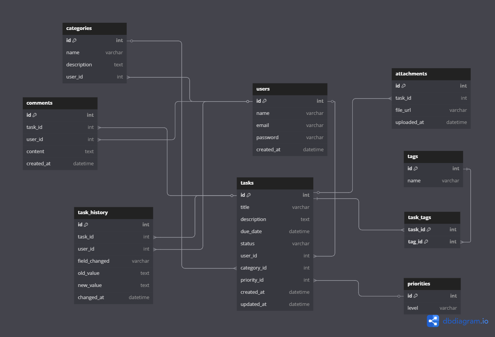
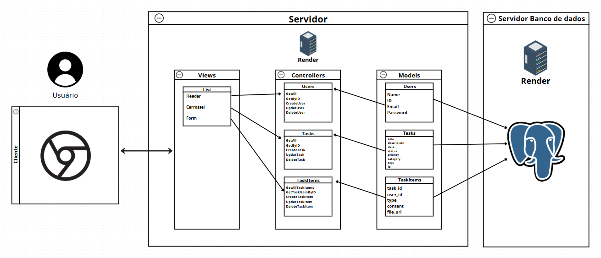
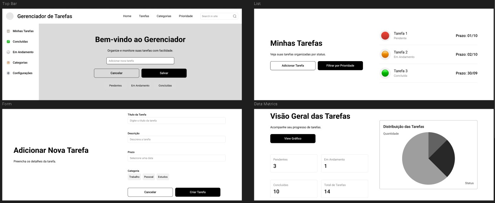

# Web Application Document - Projeto Individual - Módulo 2 - Inteli

**_Os trechos em itálico servem apenas como guia para o preenchimento da seção. Por esse motivo, não devem fazer parte da documentação final._**

## Nome do Projeto: Gerenciador de tarefas para organização e produtividade(ainda sem nome).

#### Autor do projeto: Bernardo Laurindo Gonzaga

## Sumário

1. [Introdução](#c1)  
2. [Visão Geral da Aplicação Web](#c2)  
3. [Projeto Técnico da Aplicação Web](#c3)  
4. [Desenvolvimento da Aplicação Web](#c4)  
5. [Referências](#c5)  

<br>

## <a name="c1"></a>1. Introdução (Semana 01)

&emsp;No mundo atual, a organização pessoal e a gestão de atividades são fundamentais para manter a produtividade. Pensando nisso, o sistema que será desenvolvido é um Gerenciador de Tarefas Web, focado em facilitar o planejamento e acompanhamento de atividades diárias.

&emsp;A plataforma permitirá aos usuários criar, editar, visualizar e excluir tarefas, além de organizá-las por status (pendente, em andamento e concluída).
O objetivo é construir uma aplicação moderna, responsiva e intuitiva, acessível tanto via desktop quanto dispositivos móveis. 

&emsp;O sistema contará com recursos de autenticação de usuários, categorização de tarefas e filtragem por prioridade e prazo.
Esse projeto aplicará conceitos de desenvolvimento web fullstack, incluindo frontend (React e JavaScript), backend (Node.js e JavaScript) e banco de dados (SQL/SUPABASE), garantindo integração eficiente entre todas as camadas.

&emsp;O resultado final será um sistema funcional que pode ser utilizado como produto real e apresentado em portfólios ou processos seletivos.

---

## <a name="c2"></a>2. Visão Geral da Aplicação Web

### 2.1. Personas (Semana 01)


### 2.2. User Stories (Semana 01)

US01 | Como estudante universitário, quero cadastrar novas tarefas com prazos definidos, para que eu possa me organizar melhor com os trabalhos e provas.

US02 | Como freelancer de design gráfico, quero visualizar minhas tarefas em uma lista por ordem de prioridade, para que eu possa entregar projetos com mais eficiência.

US03 | Como mãe que trabalha em home office, quero receber lembretes sobre tarefas do dia, para que eu possa conciliar melhor o trabalho com as obrigações da casa.

---

### 📋 Análise da User Story US01 com base no INVEST:
US01 | Como estudante universitário, quero cadastrar novas tarefas com prazos definidos, para que eu possa me organizar melhor com os trabalhos e provas.

I – Independente:
Pode ser desenvolvida de forma separada de outras funcionalidades, como edição, exclusão ou notificações.

N – Negociável:
A forma como o usuário insere os dados (ex.: descrição longa, tags, prioridade) pode ser ajustada durante o desenvolvimento.

V – Valiosa:
É uma das funções mais importantes para o sistema — sem ela, o usuário não consegue organizar suas atividades.

E – Estimável:
É possível estimar com clareza o tempo e recursos necessários para construir essa funcionalidade.

S – Pequena (Small):
Foca apenas na criação de tarefas e é viável de ser entregue em um curto espaço de tempo.

T – Testável:
Pode ser validada facilmente ao verificar se uma nova tarefa cadastrada aparece corretamente na lista.

---

## <a name="c3"></a>3. Projeto da Aplicação Web

### 3.1. Modelagem do banco de dados  (Semana 3)

### 1. Introdução
Este documento descreve a estrutura e os principais componentes do sistema de gerenciamento de tarefas, com foco no modelo de dados. O objetivo é apresentar a modelagem do banco de dados relacional utilizado, detalhar suas tabelas, atributos e os relacionamentos entre elas.

### 2. Diagrama 
Abaixo, encontra-se o diagrama que ilustra a modelagem do banco de dados utilizada no sistema:



### 3. Descrição das Tabelas e Relacionamentos
A seguir, são descritas as tabelas do banco de dados, seus principais atributos e a cardinalidade das relações:

### 3.1 Tabela users 📋
Armazena os dados dos usuários do sistema.

Atributos principais: id, name, email, password, created_at

Relacionamentos:

1 usuário → N categorias

1 usuário → N tarefas

1 usuário → N comentários

1 usuário → N entradas no histórico

### 3.2 Tabela categories 📋
Define categorias de tarefas criadas por usuários.

Atributos principais: id, name, description, user_id

Relacionamentos:

1 categoria → N tarefas

N categorias → 1 usuário

### 3.3 Tabela priorities 📋
Lista os níveis de prioridade para tarefas.

Atributos principais: id, level

Relacionamentos:

1 prioridade → N tarefas

### 3.4 Tabela tasks 📋
Representa as tarefas criadas no sistema.

Atributos principais: id, title, description, due_date, status, user_id, category_id, priority_id, created_at, updated_at

Relacionamentos:

1 tarefa → N comentários

1 tarefa → N anexos

1 tarefa → N entradas no histórico

N tarefas → 1 usuário, 1 categoria, 1 prioridade

N tarefas ↔ N tags (via task_tags)

### 3.5 Tabela comments 📋
Contém os comentários feitos nas tarefas.

Atributos principais: id, task_id, user_id, content, created_at

Relacionamentos:

N comentários → 1 tarefa

N comentários → 1 usuário

### 3.6 Tabela attachments 📋
Armazena arquivos anexados às tarefas.

Atributos principais: id, task_id, file_url, uploaded_at

Relacionamentos:

N anexos → 1 tarefa

### 3.7 Tabela tags 📋
Define etiquetas que podem ser associadas a tarefas.

Atributos principais: id, name

Relacionamentos:

N tags ↔ N tarefas (via task_tags)

### 3.8 Tabela task_tags 📋
Tabela de junção para o relacionamento entre tarefas e tags.

Atributos principais: task_id, tag_id

Relacionamentos:

N tarefas ↔ N tags

### 3.9 Tabela task_history 📋
Registra as alterações feitas nas tarefas.

Atributos principais: id, task_id, user_id, field_changed, old_value, new_value, changed_at

Relacionamentos:

N entradas → 1 tarefa

N entradas → 1 usuário


### 4. ModeloModelo Físico (código SQL) 
```
Table users {
  id int [pk, increment]
  name varchar
  email varchar [unique]
  password varchar
  created_at datetime
}

Table categories {
  id int [pk, increment]
  name varchar
  description text
  user_id int [ref: > users.id]
}

Table priorities {
  id int [pk, increment]
  level varchar // ex: Alta, Média, Baixa
}

Table tasks {
  id int [pk, increment]
  title varchar
  description text
  due_date datetime
  status varchar // ex: "pendente", "em andamento", "concluída"
  user_id int [ref: > users.id]
  category_id int [ref: > categories.id]
  priority_id int [ref: > priorities.id]
  created_at datetime
  updated_at datetime
}

Table comments {
  id int [pk, increment]
  task_id int [ref: > tasks.id]
  user_id int [ref: > users.id]
  content text
  created_at datetime
}

Table attachments {
  id int [pk, increment]
  task_id int [ref: > tasks.id]
  file_url varchar
  uploaded_at datetime
}

Table tags {
  id int [pk, increment]
  name varchar
}

Table task_tags {
  task_id int [ref: > tasks.id, pk]
  tag_id int [ref: > tags.id, pk]
}


Table task_history {
  id int [pk, increment]
  task_id int [ref: > tasks.id]
  user_id int [ref: > users.id]
  field_changed varchar
  old_value text
  new_value text
  changed_at datetime
}

```
---
### 3.1.1 BD e Models (Semana 5)

&emsp;No padrão MVC (Model-View-Controller), os Models são responsáveis por acessar e manipular os dados no banco. No meu projeto, criei três models principais: `User`, `Task` e `TaskItem`, cada um encapsulando operações específicas da sua respectiva tabela no banco de dados.

## 👤 User Model
Responsável pelas operações relacionadas aos usuários:

* `getAll()`: retorna todos os usuários cadastrados.

* `getById(id)`: retorna um usuário específico pelo `id`.

* `createUser(data)`: insere um novo usuário com `name`, `email` e `password`.

* `updateUser(id, data)`: atualiza os dados de um usuário existente.

* `deleteUser(id)`: remove um usuário do banco de dados.

_💡 Utiliza parâmetros para evitar SQL Injection e retorna os dados atualizados com `RETURNING`._

## Task Model ✅

Gerencia as tarefas atribuídas aos usuários:

* `getAll()`: lista todas as tarefas.

* `getById(id)`: retorna uma tarefa específica.

* `createTask(data)`: cria uma nova tarefa com campos como `title`, `description`, `due_date`, `priority`, `status`, `category`, `tags`, e `user_id`.

* `updateTask(id, data)`: atualiza uma tarefa e define `updated_at` automaticamente.

* `deleteTask(id)`: remove a tarefa do banco.

_📌 A relação com o usuário é feita via `user_id`, conectando cada tarefa a um dono._

## 📄 TaskItem Model
Reflete conteúdos multimídia ou subtarefas dentro de uma `Task`:

* `getAllTaskItems()`: retorna todos os registros da tabela `task_items`.

* `getTaskItemById(id)`: busca um item específico pelo `id`.

* `createTaskItem(data)`: cria um item vinculado a uma tarefa (`task_id`) e um usuário (`user_id`). Pode ser um texto (`content`) ou um arquivo (`file_url`).

* `updateTaskItem(id, data)`: atualiza os dados do item.

* `deleteTaskItem(id)`: remove um item.

_📎 Esse model permite que cada tarefa tenha múltiplos conteúdos associados, como documentos ou comentários._

## 📦 Considerações Técnicas
* Todos os models usam **async/await** para operações assíncronas com o banco.

* Usam **pg** para conexão com PostgreSQL via **db.query(...)**.

* As operações de **INSERT**, **UPDATE** e **DELETE** retornam os dados afetados, o que facilita o uso no front-end e testes.

### 3.2. Arquitetura (Semana 5)


 
- **Model**: A camada que lida com a lógica de negócios e interage com o banco de dados.
- **View**: A camada responsável pela interface de usuário.
- **Controller**: A camada que recebe as requisições, processa as ações e atualiza o modelo e a visualização.

### 3.3. Wireframes (Semana 03)



O wireframe apresentado está diretamente alinhado com os User Stories definidos na Semana 01, especialmente com a US01, US02 e, parcialmente, com a US03:

**US01** – Cadastrar novas tarefas com prazos definidos: O formulário "Adicionar Nova Tarefa" contempla campos como título, descrição, prazo e categoria, atendendo à necessidade do estudante universitário de registrar e organizar suas tarefas acadêmicas de forma estruturada e prática.

**US02** – Visualizar tarefas por ordem de prioridade: A seção "Minhas Tarefas" exibe tarefas com marcadores visuais (cores e status) e permite a filtragem por prioridade, oferecendo ao freelancer de design gráfico uma forma clara de identificar o que é mais urgente.

**US03** – Receber lembretes de tarefas do dia: Apesar de o wireframe não exibir explicitamente uma funcionalidade de lembretes, a estrutura atual (com prazos visíveis e categorização clara) fornece a base necessária para que uma funcionalidade de notificações possa ser facilmente incorporada no futuro.

O wireframe, portanto, traduz visualmente os objetivos das histórias de usuário, garantindo que as funcionalidades essenciais estejam representadas e preparadas para evoluções conforme o projeto avança.

link para melhor vizualização do WireFrame: https://www.figma.com/design/aHfdHuaLQGHvrgSiBSu3jp/WireFrame-Projeto-Individual?node-id=0-1&t=EaGnN8jyxlgMmLQW-1

### 3.4. Guia de estilos (Semana 05)

*Descreva aqui orientações gerais para o leitor sobre como utilizar os componentes do guia de estilos de sua solução.*


### 3.5. Protótipo de alta fidelidade (Semana 05)

*Posicione aqui algumas imagens demonstrativas de seu protótipo de alta fidelidade e o link para acesso ao protótipo completo (mantenha o link sempre público para visualização).*

### 3.6. WebAPI e endpoints (Semana 05)

## 🚀 ENDPOINTS DO SISTEMA

### 👤 Usuários (Users)

| Método | Rota         | Descrição                              | Função do controller |
| ------ | ------------ | -------------------------------------- | -------------------- |
| GET    | `/users`     | Lista todos os usuários                | `getAll()`           |
| GET    | `/users/:id` | Retorna um usuário específico por `id` | `getById()`          |
| POST   | `/users`     | Cria um novo usuário                   | `createUser()`       |
| PUT    | `/users/:id` | Atualiza um usuário                    | `updateUser()`       |
| DELETE | `/users/:id` | Remove um usuário                      | `deleteUser()`       |

**📌 Observações**:

* O `POST /users` espera `name`, `email`, `password` no body.

* O `PUT` atualiza os mesmos campos.

* O sistema retorna erro 404 caso o `id` não seja encontrado.

---

### ✅ Tarefas (Tasks)

| Método | Rota         | Descrição                       | Função do controller |
| ------ | ------------ | ------------------------------- | -------------------- |
| GET    | `/tasks`     | Lista todas as tarefas          | `getAllTasks()`      |
| GET    | `/tasks/:id` | Retorna uma tarefa específica   | `getTaskById()`      |
| POST   | `/tasks`     | Cria uma nova tarefa            | `createTask()`       |
| PUT    | `/tasks/:id` | Atualiza os dados de uma tarefa | `updateTask()`       |
| DELETE | `/tasks/:id` | Exclui uma tarefa               | `deleteTask()`       |

**📌 Observações**:

* `POST /tasks` espera um objeto com: `title`, `description`, `due_date`, `status`, `priority`, `category`, `tags`, `user_id`.

* Campos opcionais como `tags` e `category` devem ser tratados no front.

* No `PUT`, o campo `updated_at` é atualizado automaticamente.

---

### 📄 Itens da Tarefa (TaskItems)

| Método | Rota              | Descrição                                | Função do controller |
| ------ | ----------------- | ---------------------------------------- | -------------------- |
| GET    | `/task-items`     | Lista todos os itens de tarefa           | `getAllTaskItems()`  |
| GET    | `/task-items/:id` | Retorna um item de tarefa por `id`       | `getTaskItemById()`  |
| POST   | `/task-items`     | Cria um novo item de tarefa              | `createTaskItem()`   |
| PUT    | `/task-items/:id` | Atualiza `content` ou `file_url` do item | `updateTaskItem()`   |
| DELETE | `/task-items/:id` | Deleta um item da tarefa                 | `deleteTaskItem()`   |

**📌 Observações:**

* Um item pode conter `content` (texto), `file_url` (link de arquivo) ou ambos.

* Está relacionado com uma tarefa (`task_id`) e um usuário (`user_id`).

---

### 🧩 Integração entre os dados

* Um `user` pode ter várias `tasks`.

* Uma `task` pode ter vários `task_items`.

* Um `task_item` pertence a uma `task` e a um `user`.


### 3.7 Interface e Navegação (Semana 07)

*Descreva e ilustre aqui o desenvolvimento do frontend do sistema web, explicando brevemente o que foi entregue em termos de código e sistema. Utilize prints de tela para ilustrar.*

---

## <a name="c4"></a>4. Desenvolvimento da Aplicação Web (Semana 8)

### 4.1 Demonstração do Sistema Web (Semana 8)

*VIDEO: Insira o link do vídeo demonstrativo nesta seção*
*Descreva e ilustre aqui o desenvolvimento do sistema web completo, explicando brevemente o que foi entregue em termos de código e sistema. Utilize prints de tela para ilustrar.*

### 4.2 Conclusões e Trabalhos Futuros (Semana 8)

*Indique pontos fortes e pontos a melhorar de maneira geral.*
*Relacione também quaisquer outras ideias que você tenha para melhorias futuras.*


## <a name="c5"></a>5. Referências

_Incluir as principais referências de seu projeto, para que seu parceiro possa consultar caso ele se interessar em aprofundar. Um exemplo de referência de livro e de site:_<br>

---
---